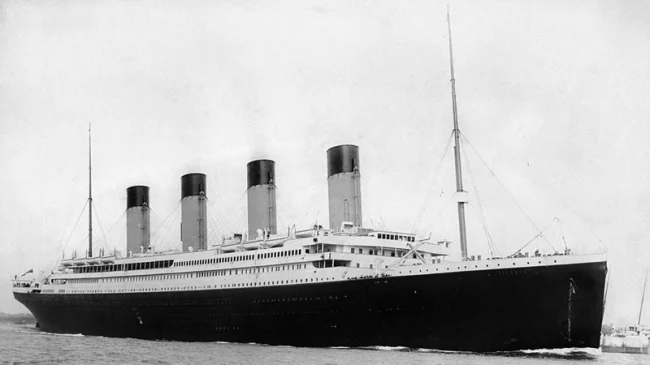

# Predicting survivors in the Titanic disaster



<br>

# 1. Overview

_"The sinking of the Titanic is one of the most infamous shipwrecks in history._

_On April 15, 1912, during her maiden voyage, the widely considered “unsinkable” RMS Titanic sank after colliding with an iceberg. Unfortunately, there weren’t enough lifeboats for everyone onboard, resulting in the death of 1502 out of 2224 passengers and crew._

_While there was some element of luck involved in surviving, it seems some groups of people were more likely to survive than others._

_In this challenge, we ask you to build a predictive model that answers the question: “what sorts of people were more likely to survive?” using passenger data (ie name, age, gender, socio-economic class, etc)."_

See on [kaggle](https://www.kaggle.com/competitions/titanic/overview)


<br>


# 2. How to use

Create a new virtual environment and activate, then:

```sh
make requirements
```
and download data sets from kaggle:

```sh
make data
```

You can run the [eda](titanic_eda.ipynb) notebook to see the analysis, and the [model](titanic_model.ipynb)  notebook to see the modeling.